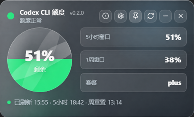
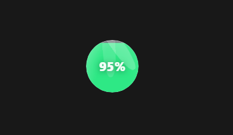

# Codex CLI 额度小组件

[简体中文](README.md)

Codex CLI Quota Widget is a desktop floating widget. It reads quota data from your local signed-in Codex CLI and shows remaining quota, quota windows, reset credits, refresh time, and reset time in a compact panel or floating ball.

### Features

- Panel mode: shows remaining quota, 5-hour window, weekly window, reset credits, refresh time, and reset time.
  
- Floating ball mode: keeps quota visible in a small desktop widget.
  
- Edge docking: docks the floating ball to the left or right screen edge.
- Status colors: green for healthy, yellow for low, red for critical, empty, or error, and blue for loading.
- Auto refresh: refreshes every 5 minutes by default and can refresh again after quota reset.
- Auto update: enabled by default and uses GitHub Releases.
- Start at login: disabled by default and can be enabled in settings for the current user.
- Theme switch: choose Default or Basic theme 1 in settings. Default keeps the classic style, while Basic theme 1 uses a glassmorphism style.
- Language switch: supports Chinese and English, with Chinese as the default.

### How To Use

1. Install and sign in to Codex CLI.
2. Start this app.
3. The app tries to detect `codex` or `codex.exe` automatically.
4. If reading fails, open settings and choose the `codex` or `codex.exe` path manually.
5. Check remaining quota, 5-hour quota, weekly quota, and reset credits in the panel.
6. Click the circle button to switch to floating ball mode; double-click the ball to restore the panel.

### Settings

- Codex CLI path: leave empty for auto detection, or choose a specific `codex` or `codex.exe`.
- Auto update: when disabled, the app does not check, download, or install GitHub Releases updates. A local proxy may be required.
- Update proxy: used only for GitHub updates, not for Codex CLI quota reads. Supports `http://`, `https://`, and `socks5://`.
- Start at login: launches the app after signing in. Current user only.
- Refresh minutes: auto refresh interval, from `1` to `1440`.
- Theme: choose Default or Basic theme 1. The selection persists after restart.
- Language: choose Chinese or English.

### Privacy

This app only calls the local Codex CLI and reuses your local sign-in state. It does not ask for tokens, store tokens, or upload quota data.

### Community

- [LINUX DO](https://linux.do)

### Troubleshooting

**Codex CLI not found**

Choose `codex` or `codex.exe` manually in settings. The app checks the saved path first, then `CODEX_CLI_PATH`, common install paths, and `PATH`.

**Quota read failed**

Make sure Codex CLI is installed, runnable, and signed in. You can run `codex` in a terminal to check.

**Auto update is slow or failed**

Auto update depends on GitHub Releases. Configure an update proxy in settings if GitHub is not reachable.

**Start at login does not work**

Disable and enable it again in settings, and make sure your system startup items or login items allow this app. Administrator permission is not required.

### Development

```powershell
npm install
npm run tauri:dev
npm run build
cargo check --manifest-path src-tauri/Cargo.toml
cargo test --manifest-path src-tauri/Cargo.toml
npm run tauri:build:nsis
npm run tauri:build:mac:aarch64:updater
npm run tauri:build:mac:x64:updater
npm run release:github
```

Release asset names:

```txt
codex-widget_{version}_windows_x64-setup.exe
codex-widget_{version}_windows_x64-setup.exe.sig
codex-widget_{version}_macos_aarch64.dmg
codex-widget_{version}_macos_aarch64.app.tar.gz
codex-widget_{version}_macos_aarch64.app.tar.gz.sig
codex-widget_{version}_macos_x64.dmg
codex-widget_{version}_macos_x64.app.tar.gz
codex-widget_{version}_macos_x64.app.tar.gz.sig
latest.json
```
