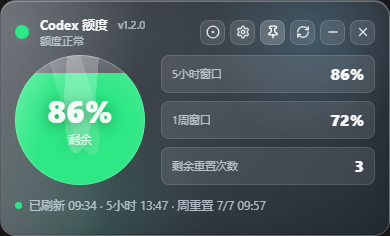
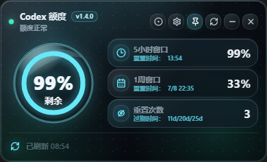
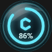
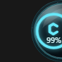
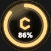
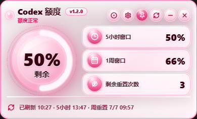
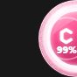

# Codex Quota Widget

[简体中文](README.md)

Codex Quota Widget is a desktop floating widget. It reads quota data from your local signed-in Codex and shows 5-hour quota, weekly quota, previous/current weekly quota estimates, reset credits, refresh time, and reset time in a compact panel or floating ball.

### Features

- Panel mode: each of the three data bars can show the 5-hour window, weekly window, reset credits, or quota estimate. Duplicate selections are allowed.
- Plan defaults: Plus uses "5-hour window / weekly window / quota estimate"; other or unknown plans use "quota estimate / weekly window / reset credits".
- Meter and floating ball: choose the 5-hour or weekly quota in settings. New configurations default to weekly quota.
- Edge docking: docks the floating ball to the left or right screen edge.
- Status colors: green for healthy, yellow for low, red for critical, empty, or error, and blue for loading.
- Auto refresh: refreshes every 5 minutes by default and can refresh again after quota reset.
- Auto update: enabled by default and uses GitHub Releases.
- Start at login: disabled by default and can be enabled in settings for the current user.
- macOS menu bar mode: optionally hide the Dock icon and keep the menu bar icon as the app entry point.
- Theme switch: choose a theme in settings.
- Language switch: supports Chinese and English, with Chinese as the default.

### Theme Gallery

#### Default theme

<table>
  <tr>
    <td rowspan="2" style="text-align: center;"><strong>Panel</strong><br></td>
    <td style="text-align: center;"><strong>Floating ball</strong><br></td>
  </tr>
  <tr>
    <td style="text-align: center;"><strong>Docked</strong><br></td>
  </tr>
</table>

#### Basic theme 1

<table>
  <tr>
    <td rowspan="2" style="text-align: center;"><strong>Panel</strong><br></td>
    <td style="text-align: center;"><strong>Floating ball</strong><br></td>
  </tr>
  <tr>
    <td style="text-align: center;"><strong>Docked</strong><br></td>
  </tr>
</table>

#### Basic theme 2

<table>
  <tr>
    <td rowspan="2" style="text-align: center;"><strong>Panel</strong><br></td>
    <td style="text-align: center;"><strong>Floating ball</strong><br></td>
  </tr>
  <tr>
    <td style="text-align: center;"><strong>Docked</strong><br></td>
  </tr>
</table>

#### Basic theme 3

<table>
  <tr>
    <td rowspan="2" style="text-align: center;"><strong>Panel</strong><br></td>
    <td style="text-align: center;"><strong>Floating ball</strong><br></td>
  </tr>
  <tr>
    <td style="text-align: center;"><strong>Docked</strong><br></td>
  </tr>
</table>

### How To Use

1. Install and sign in to Codex.
2. Start this app.
3. The app tries to detect `codex` or `codex.exe` automatically.
4. If reading fails, open settings and choose the `codex` or `codex.exe` path manually.
5. Check the three panel data bars, then adjust each bar and the meter window in settings when needed.
6. Click the circle button to switch to floating ball mode; double-click the ball to restore the panel.

### Settings

- Codex path: leave empty for auto detection, or choose a specific `codex` or `codex.exe`.
- Auto update: when disabled, the app does not check, download, or install GitHub Releases updates. A local proxy may be required.
- Update proxy: used for GitHub updates and the ChatGPT quota expiry API. It does not affect the main Codex CLI quota read. Supports `http://`, `https://`, and `socks5://`.
- Start at login: launches the app after signing in. Current user only.
- Hide Dock icon: available on macOS only. Saving applies the change immediately; the menu bar icon remains available to show the window or quit.
- Refresh minutes: auto refresh interval, from `1` to `1440`.
- Theme: choose Default theme, Basic theme 1, Basic theme 2, and Basic theme 3. The selection persists after restart.
- Language: choose Chinese or English.
- Meter window: choose whether the meter and floating ball show the 5-hour or weekly quota. Weekly is the default.
- Data bars 1/2/3: each bar can show the 5-hour window, weekly window, reset credits, or quota estimate, including duplicates. Plan defaults apply until a custom layout is saved.
- Missing data: if the selected 5-hour window or other source is unavailable, the bar shows `--` and does not substitute another source.

### Quota Estimate Formula

The quota estimate is the Token API equivalent value of 100% weekly quota. It is intended as a rough comparison, not an actual OpenAI bill. Results meeting the sample and span gates are rounded to whole dollars; results below either gate display `--`.

#### Data and cycle selection

The app streams local session logs from the latest 16 days under `CODEX_HOME/sessions` and `CODEX_HOME/archived_sessions`. It extracts only model, Token usage, weekly quota percentage, and reset time. If the same rollout briefly exists in both locations during an archive move, only the newer copy is read; cumulative Token fingerprints continue to deduplicate events within each file. A weekly window is identified as `10080` minutes; reset times drifting by no more than 30 minutes belong to one cycle. The current cycle may differ from the live reset time by up to 2 hours, and the previous cycle is the nearest valid earlier cycle.

`codex-auto-review` is estimated using GPT-5.4 pricing and participates normally in cost accumulation and candidate calculation. Other models without public pricing are not guessed and terminate the current sample segment. A new clean segment starts from a new quota-percentage and cost baseline, preventing unknown models from contaminating later estimates.

#### Built-in price table

Price table date: `2026-08-25`. All prices are USD per million Tokens, ordered as input, cached input, and output.

| Model | Input | Cached input | Output |
|---|---:|---:|---:|
| [GPT-5.6 Sol](https://developers.openai.com/api/docs/models/gpt-5.6-sol) | 4 | 0.4 | 20 |
| [GPT-5.6 Terra](https://developers.openai.com/api/docs/models/gpt-5.6-terra) | 2 | 0.2 | 12 |
| [GPT-5.6 Luna](https://developers.openai.com/api/docs/models/gpt-5.6-luna) | 0.2 | 0.02 | 1.2 |
| [GPT-5.5](https://developers.openai.com/api/docs/models/gpt-5.5) | 5 | 0.5 | 30 |
| [GPT-5.4](https://developers.openai.com/api/docs/models/gpt-5.4) | 2.5 | 0.25 | 15 |

GPT-5.6 cache writes use `1.25×` the input price. GPT-5.4, including `codex-auto-review`, has no separate cache-write rate, so cache writes use the normal input price; `0.25` applies only to cache hits. GPT-5.5 has no built-in public cache-write price, so events containing cache-write Tokens remain unpriced.

#### Per-event cost

Variables:

- `I`: input Tokens.
- `C`: cached input Tokens.
- `W`: cache-write Tokens.
- `O`: output Tokens.
- `P_in`, `P_cached`, `P_write`, and `P_out`: the model's per-million Token prices.

```text
U = max(I - C - W, 0)

When I <= 272000: m_in = 1, m_out = 1
When I > 272000:  m_in = 2, m_out = 1.5

Cost = [m_in × (U × P_in + C × P_cached + W × P_write)
        + m_out × O × P_out] / 1,000,000
```

Cached input and cache-write Tokens are deducted from input Tokens first. Reasoning Tokens are not added again. Tool-call fees are excluded.

#### Robust weekly quota estimate

The app builds an incremental candidate for each adjacent percentage increase. Let `C_i` be cumulative locally priced USD in the interval and `ΔP_i` be the weekly quota used-percentage increase:

```text
E_i = 100 × C_i / ΔP_i
100% weekly quota API equivalent = weightedMedian(E_i, weight = ΔP_i)
```

When adjacent local events are at least `15` minutes apart and the account percentage increases, the boundary delta cannot be separated into local and other-device usage. The app isolates that delta and starts from a new baseline. Remaining candidates are sorted, and the largest consistent cluster satisfying `maximum candidate / minimum candidate ≤ 1.5` is selected. Ties prefer greater total percentage span, then the higher amount. Candidates outside the cluster are reported as suspected cross-device intervals.

Effective span is the union length of percentage intervals covered by the consistent cluster; overlaps count once and unobserved gaps are not filled. An amount is shown only when the cluster contains at least `3` samples, covers at least `2%` unique span, and has a positive finite weighted median. Changes in model mix, long-context share, cache hits, and sample distribution can still change the estimate.

### Privacy

This app only calls the local Codex and reuses your local sign-in state. It does not ask for or store tokens. Quota estimation reads only structured metering fields from local session logs; it does not read conversation content, upload session logs or estimates, or persist estimate results.

### Community

- [LINUX DO](https://linux.do)

### Troubleshooting

**Codex CLI not found**

Choose `codex` or `codex.exe` manually in settings. The app checks the saved path first, then `CODEX_CLI_PATH`, the system `PATH`, and common install locations. On macOS it also detects `~/.nvm/versions/node/*/bin/codex` and adds the matching Node directory to the Codex child process, so Finder launches do not depend on `.zshrc`. You can also install the standalone build from the [official Codex CLI instructions](https://developers.openai.com/codex/cli/).

**Quota read failed**

Make sure Codex is installed, runnable, and signed in. You can run `codex` in a terminal to check.

**Auto update is slow or failed**

Auto update depends on GitHub Releases. Configure an update proxy in settings if GitHub is not reachable.

**Start at login does not work**

Disable and enable it again in settings, and make sure your system startup items or login items allow this app. Administrator permission is not required.

### Development

```powershell
npm install
npm run tauri:dev
npm run build
cargo check --manifest-path src-tauri/Cargo.toml
cargo test --manifest-path src-tauri/Cargo.toml
npm run tauri:build:nsis
npm run tauri:build:mac:aarch64:updater
npm run tauri:build:mac:x64:updater
npm run release:github
```

Release asset names:

```txt
codex-widget_{version}_windows_x64-setup.exe
codex-widget_{version}_windows_x64-setup.exe.sig
codex-widget_{version}_macos_aarch64.dmg
codex-widget_{version}_macos_aarch64.app.tar.gz
codex-widget_{version}_macos_aarch64.app.tar.gz.sig
codex-widget_{version}_macos_x64.dmg
codex-widget_{version}_macos_x64.app.tar.gz
codex-widget_{version}_macos_x64.app.tar.gz.sig
latest.json
```
