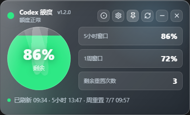
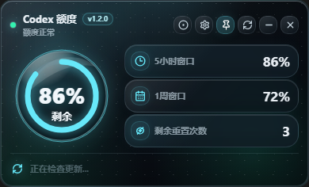
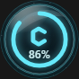
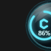

# Codex 额度小组件

[English](README.en.md)

Codex 额度小组件是一个桌面悬浮工具。它通过本机已登录的 Codex 读取额度信息，并用面板或悬浮球展示当前可用额度、窗口额度、剩余重置次数、刷新时间和重置时间。

### 功能介绍


- 面板模式：展示总剩余额度、5 小时窗口、1 周窗口、剩余重置次数、刷新时间和重置时间。

- 悬浮球模式：用更小窗口展示剩余额度，适合长期放在桌面边缘。
- 边缘吸附：悬浮球可贴靠屏幕左右边缘，减少遮挡。
- 状态颜色：正常为绿色，偏低为黄色，不足、耗尽或错误为红色，读取中为蓝色。
- 自动刷新：默认每 5 分钟刷新一次，也会根据额度重置时间补充刷新。
- 自动更新：默认开启，通过 GitHub Releases 下载并安装更新。
- 开机自启：默认关闭，可在设置中开启，仅对当前用户生效。
- 主题切换：设置中可选择主题。

- 中英文界面：设置中可切换中文和 English，默认中文。

### 主题展示

#### 默认主题

<table>
  <tr>
    <td rowspan="2" align="center"><strong>面板</strong><br></td>
    <td align="center"><strong>悬浮球</strong><br></td>
  </tr>
  <tr>
    <td align="center"><strong>吸附</strong><br></td>
  </tr>
</table>

#### 基础主题 1

<table>
  <tr>
    <td rowspan="2" align="center"><strong>面板</strong><br></td>
    <td align="center"><strong>悬浮球</strong><br></td>
  </tr>
  <tr>
    <td align="center"><strong>吸附</strong><br></td>
  </tr>
</table>

#### 基础主题 2

<table>
  <tr>
    <td rowspan="2" align="center"><strong>面板</strong><br></td>
    <td align="center"><strong>悬浮球</strong><br></td>
  </tr>
  <tr>
    <td align="center"><strong>吸附</strong><br></td>
  </tr>
</table>

### 使用教程

1. 安装并登录 Codex。
2. 启动本应用。
3. 首次启动后，应用会自动探测本机 `codex` 或 `codex.exe`。
4. 如果读取失败，打开设置，手动选择 `codex` 或 `codex.exe` 路径。
5. 查看主面板中的剩余额度、5 小时窗口、1 周窗口和剩余重置次数。
6. 点击圆形按钮切换悬浮球模式；双击悬浮球可回到面板。

### 设置说明

- Codex 路径：留空时自动探测；填写后优先使用该路径。
- 自动更新：关闭后不会检查、下载或安装 GitHub Releases 更新 (可能需要配置本地代理)。
- 自动更新代理：仅用于 GitHub 更新，不影响 Codex 读取额度。支持 `http://`、`https://`、`socks5://`。
- 开机自启：登录系统后自动启动本应用，仅当前用户生效。
- 刷新分钟：自动刷新间隔，范围为 `1-1440`。
- 主题：可选择默认主题、基础主题 1、基础主题 2，保存后重启仍保留。
- 语言：可选择中文或 English。

### 隐私说明

本应用只调用本机已有的 Codex，并复用本机登录状态读取额度。本应用不会要求输入 Token，不会保存 Token，也不会上传额度数据。

### 社区

- [LINUX DO](https://linux.do)

### 常见问题

**找不到 Codex CLI**

在设置中手动选择 `codex` 或 `codex.exe`。应用会优先使用设置中的路径，其次读取 `CODEX_CLI_PATH`，再尝试系统常见安装目录和 `PATH`。

**额度读取失败**

确认 Codex 已安装、可运行并已登录。可以在终端运行 `codex` 检查登录状态。

**自动更新慢或失败**

自动更新依赖 GitHub Releases。如果网络不可达，在设置中配置自动更新代理。

**开机自启未生效**

关闭后重新开启一次开机自启，并确认系统启动项或登录项没有禁用本应用。本功能不需要管理员权限。

### 本地开发

安装依赖：

```powershell
npm install
```

启动开发模式：

```powershell
npm run tauri:dev
```

构建前端：

```powershell
npm run build
```

检查 Rust：

```powershell
cargo check --manifest-path src-tauri/Cargo.toml
```

运行 Rust 测试：

```powershell
cargo test --manifest-path src-tauri/Cargo.toml
```

生成 Windows NSIS 安装包：

```powershell
npm run tauri:build:nsis
```

生成 macOS Apple Silicon 安装包和更新包：

```powershell
npm run tauri:build:mac:aarch64:updater
```

生成 macOS Intel 安装包和更新包：

```powershell
npm run tauri:build:mac:x64:updater
```

生成 GitHub Release 产物：

```powershell
npm run release:github
```

Release 产物命名：

```txt
codex-widget_{version}_windows_x64-setup.exe
codex-widget_{version}_windows_x64-setup.exe.sig
codex-widget_{version}_macos_aarch64.dmg
codex-widget_{version}_macos_aarch64.app.tar.gz
codex-widget_{version}_macos_aarch64.app.tar.gz.sig
codex-widget_{version}_macos_x64.dmg
codex-widget_{version}_macos_x64.app.tar.gz
codex-widget_{version}_macos_x64.app.tar.gz.sig
latest.json
```

### 项目结构

```txt
codex-widget/
├─ .github/workflows/   # GitHub Actions 发布流程
├─ docs/assets/         # README 图片资源
├─ src/                 # 前端界面与交互
├─ src-tauri/           # Rust 后端、Tauri 配置和图标资源
├─ scripts/             # 图标生成和发布产物整理脚本
├─ index.html           # Vite 页面入口
├─ package.json         # 前端依赖和 npm 脚本
└─ README.md
```
