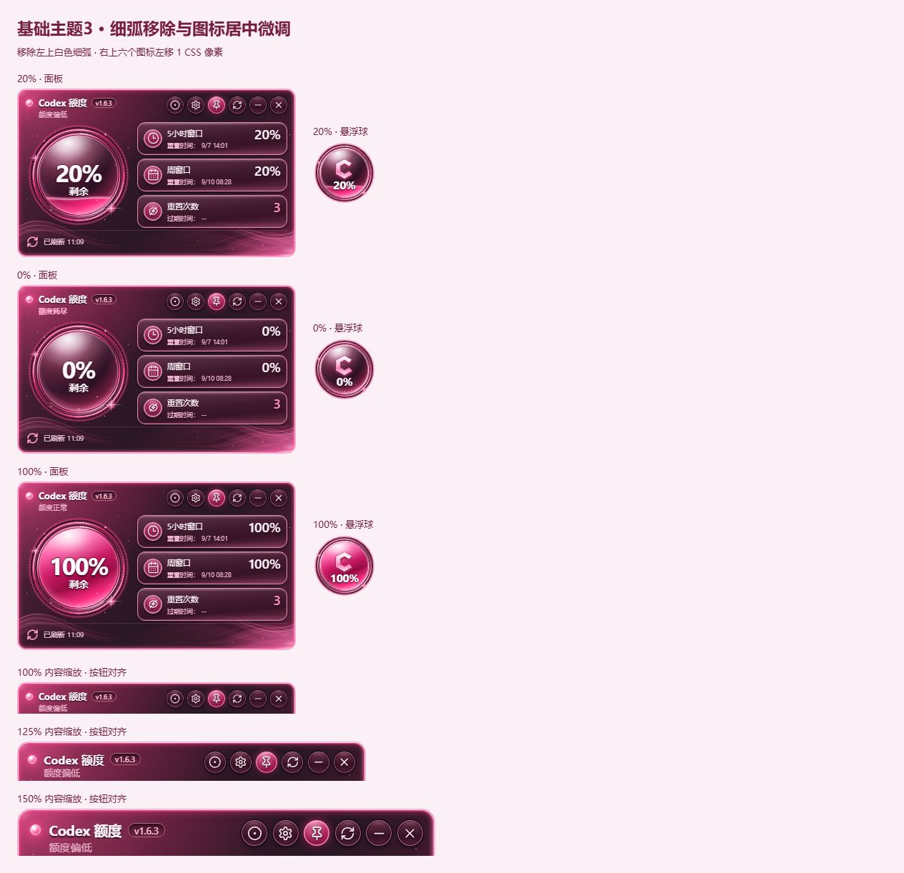
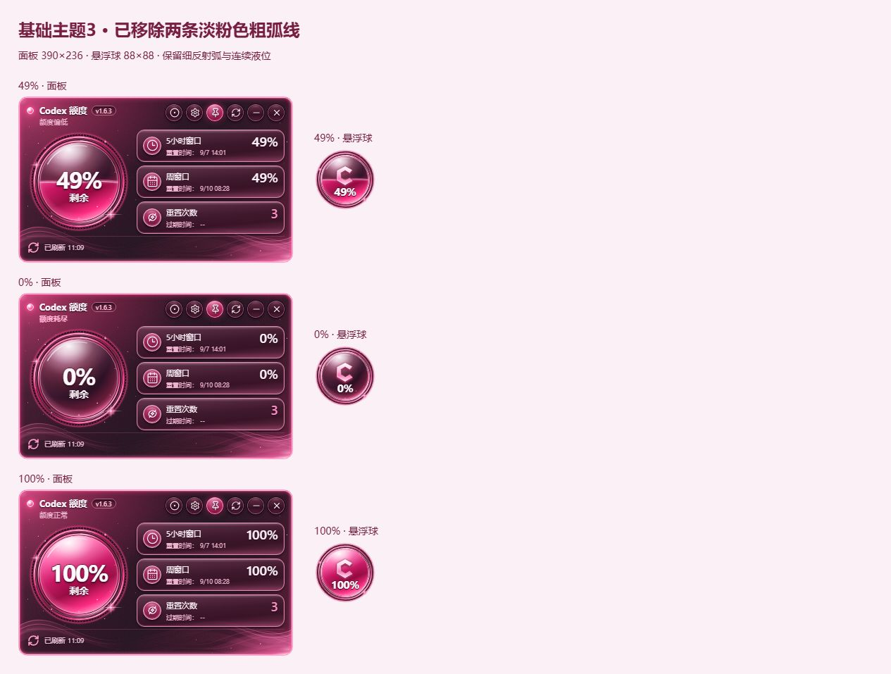
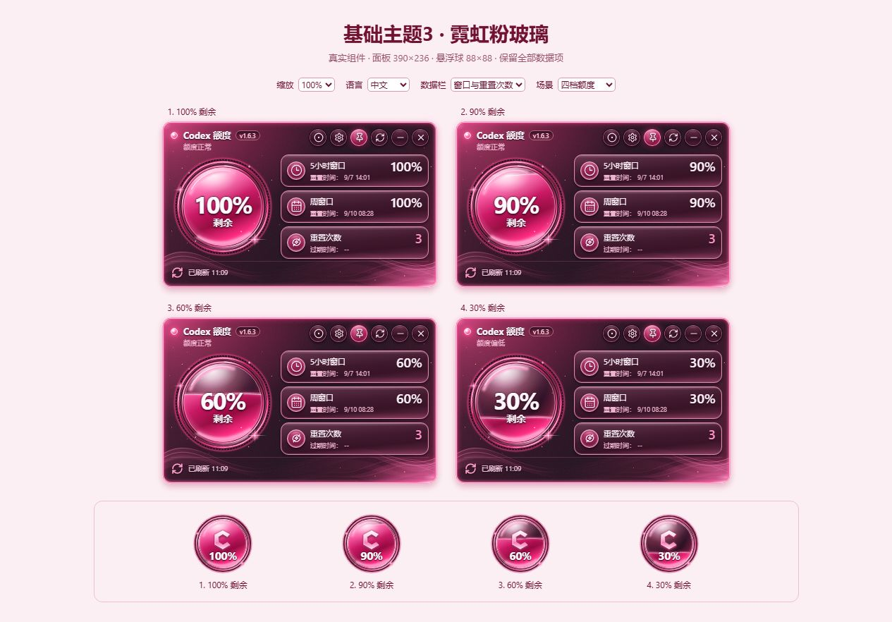
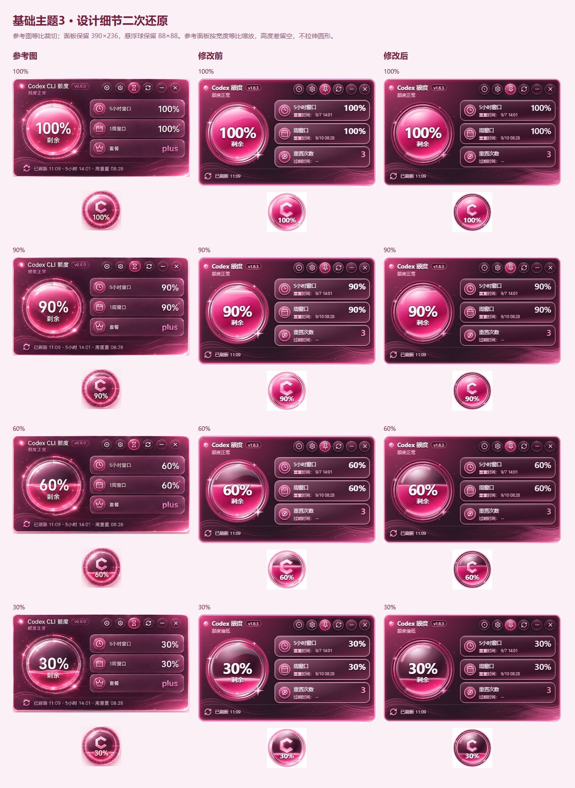
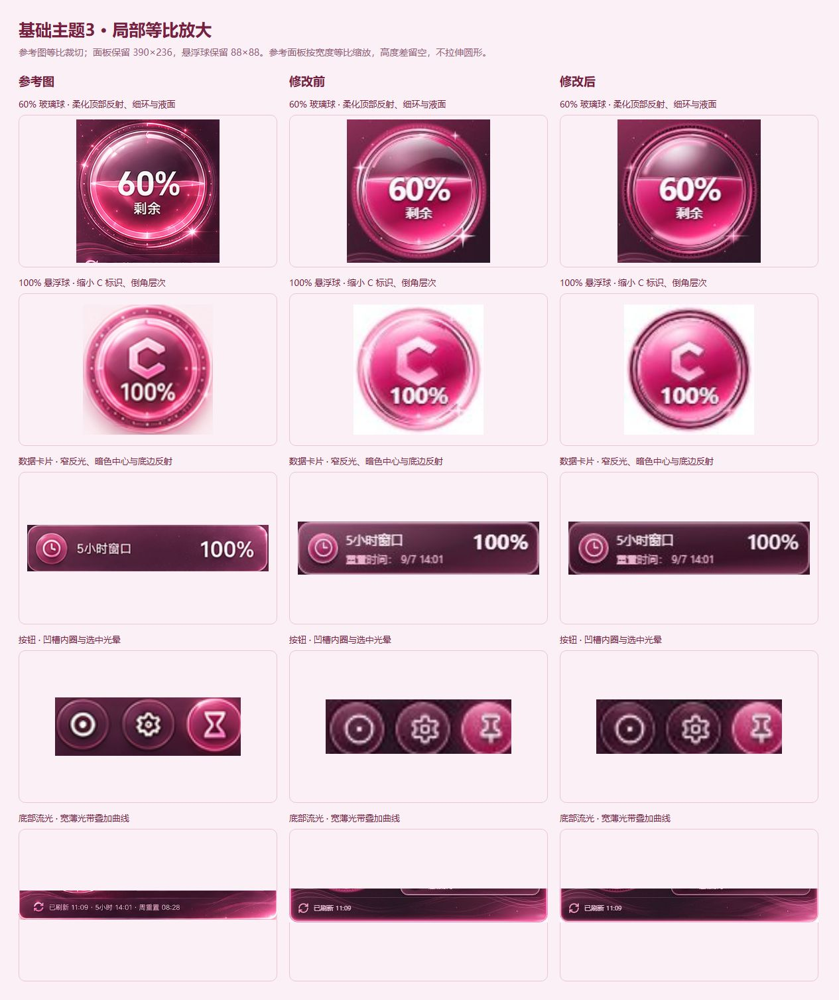
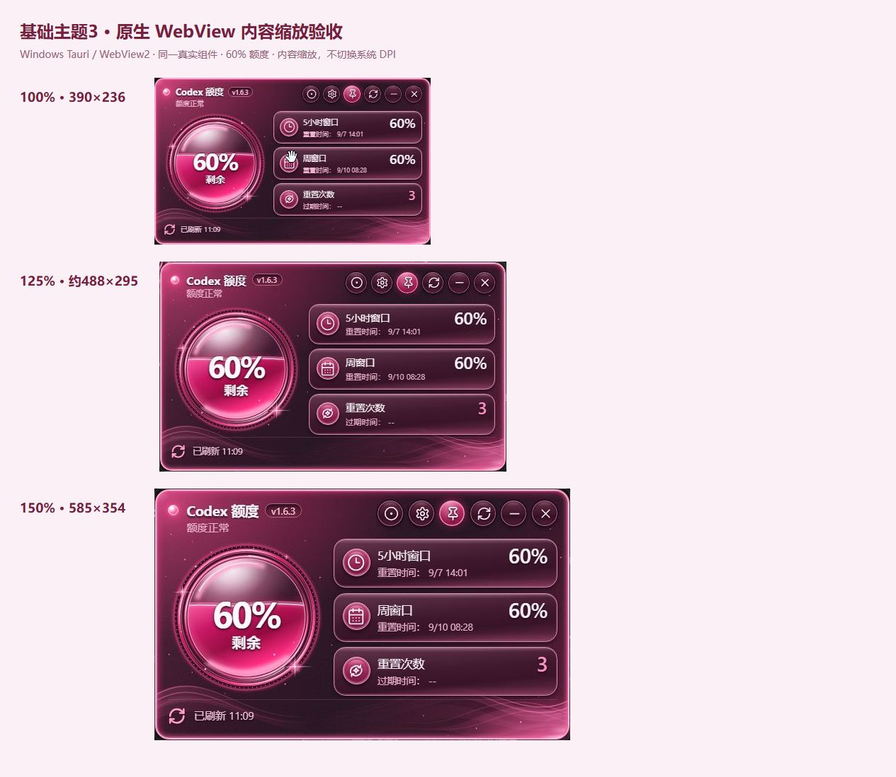

# 基础主题3视觉验收

## 最新调整：左上细弧与按钮图标

删除左上白色细弧子路径，保留右上、底部细弧及球面渐变；右上六个按钮 SVG 仅在主题3中以相对定位左移 1 CSS 像素。按钮尺寸、点击范围和原有变换不变。

20%、0%、100% 的面板与悬浮球均已检查；100%、125%、150% 内容缩放下六个图标垂直中心偏差均为 0，左移量为 1 CSS 像素。悬停、置顶选中切换及按下时图标偏移检查通过。ESLint、40 项仪表与渲染器测试及生产前端构建通过。下面较早的截图保留为历史记录。

## 最新调整：移除两条粗弧线

删除 `basic3-gauge-reflection-soft` 装饰路径，面板与悬浮球同步移除左上、底部淡粉色粗弧；保留球面渐变、细反射弧、光环、星芒及液位。49%、0%、100% 的两种模式均已检查，ESLint、22 项仪表测试及生产前端构建通过。下方二次还原对照图保留为历史基线。

主题3采用深酒红背景、霓虹粉描边、玻璃卡片和连续液位球。保留面板 390×236、悬浮球 88×88，以及当前版本、数据栏配置、附加时间和全部业务逻辑。

## 复查方式

运行 `npm run dev`，打开 [视觉验收页](http://127.0.0.1:1420/docs/basic3-preview.html)。页面直接使用生产仪表、渲染器、设置及窗口控制器；模拟数据仅存在于独立验收脚本，不调用真实额度服务或写入真实配置。

- 四档额度：100%、90%、60%、30%的完整面板及悬浮球。
- 可切换中文、英文、重置次数、额度估算和 100%/125%/150% 渲染缩放。
- 边界与异常：0%、10%、无数据、读取失败。
- 左右贴边：模拟屏幕半球裁切，检查标识和数字的可读性。
- 单面板地址支持 `?frame=panel&percent=loading&locale=zh` 检查加载状态；`frame=ball` 检查悬浮球。

## 已完成的验证

- ESLint、18 个测试文件共 162 项测试、生产前端构建通过；补充液位边界、曲线接缝与多实例 SVG 引用隔离测试。
- 浏览器检查四档视觉、中英文、两种第三栏内容、异常状态、左右贴边、设置菜单与取消恢复、保存、面板与球切换、双击恢复。
- 用参考图单面板裁切进行同尺寸并排与半透明叠图检查；现有标题、数据内容和卡片内时间按确认要求保留。
- 隔离的 Windows Tauri/WebView2 实例检查 100%、125%、150% 内容渲染缩放，未发现窗口裁切或布局溢出。这里采用内容缩放配合窗口尺寸，不包含切换操作系统 DPI 或跨显示器 DPI 迁移测试。
- 刷新、置顶、隐藏、退出、版本检查、窗口拖动及设置持久化由现有控制器测试回归；验收页不执行对应的真实外部操作。

本轮本地诊断截图位于 `.vite/basic3-qa/`，包含原生三档缩放、设置、贴边和参考图叠图。四档成品截图保存于上述文档图片中。

## 二次细节还原（2026-09-08）

- 顶部反射改为透明度渐隐的白粉径向渐变，补充左上弧形折射和底部粉色反光，保留深酒红球心。
- 液体与前沿亮线共用三次贝塞尔曲线，后沿沿同一曲线轻微上移。液位仍从 114 连续映射到 16；波幅最多 1.8 个 SVG 单位，前后 10% 区间逐渐收敛，空额、满额与无数据隐藏液面亮线。
- 光环区分暗槽、玫红细环、刻度和细白反射弧；星芒改为细亮核心与柔光。C 标识缩小至上一版的 80%，增加侧面与倒角。
- 卡片、按钮收窄顶部反光，中央透暗、底边反粉光；背景增加三条薄光带和固定的不均匀星点。边框改为细白芯和方向性粉色光晕。装饰未新增持续动画。
- 变更仅涉及主题3仪表、主题 CSS、背景 SVG，以及对应测试和验收资料；业务控制器与数据来源不变。

### 三方视觉对照

面板参考裁切等比缩放到 390 像素宽，原图纵横比与目标面板不同，高度差留空；圆形元素分别按直径等比比较。截图保留当前真实组件的版本、数据栏和附加时间。局部图放大的是实际尺寸截图，保留实际渲染的像素信息。

### 本轮验证结果

- `npm run check` 全部通过：ESLint、162 项前端测试、生产前端构建、npm 审计（0 个漏洞）、Rust 格式检查、Clippy 和 118 项 Rust 测试。
- 浏览器逐档检查 100%、90%、60%、30%、0%、10%、无数据、错误、加载；检查英文额度估算、附加时间和左右半球的小字号。保留原有文案与状态判定。
- 设置中切换基础主题2后取消可恢复主题3；修改数据栏后保存、面板切换悬浮球和双击恢复通过。控制器测试继续覆盖刷新、置顶、隐藏、退出、版本检查及拖动恢复；独立验收页不执行真实账户读写。
- Windows 原生 Tauri/WebView2 的 100%、125%、150% 内容缩放均已重新截图，未发现重要内容裁切。窗口分别约 390×236、488×295、585×354；不包含系统 DPI 切换。
- 修改前源码与原尺寸截图保存于 `.vite/basic3-v2/before/`，修改后截图位于 `.vite/basic3-v2/after/`；该目录另含三档原生窗口、边界状态、英文估算、贴边和加载截图。生成对照的本地页面为 `.vite/basic3-v2/comparison.html`，局部页使用 `?details`。
