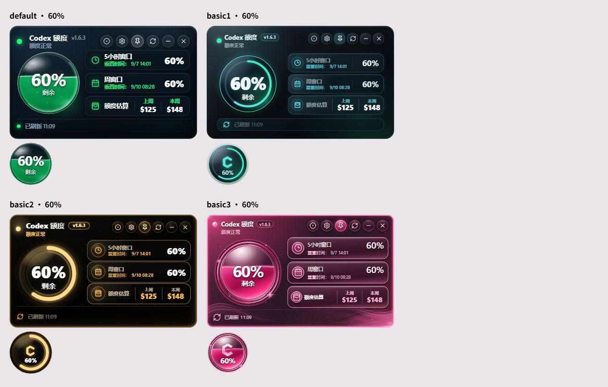

# 全局代码优化验收记录

日期：2026-09-11。基线为本轮开始时的干净工作区，版本 1.6.3。所有改动保留在工作区，未提交、推送或发布。

## 优化清单

- 应用及持有资源的控制器统一使用幂等 `destroy()`；重复启动不重复绑定。构造中途失败、启动失败、页面卸载及开发热替换均清理已创建资源。
- 回收 DOM、Tauri 和窗口移动监听，以及刷新、更新、提示、拖动定时器、动画帧、仪表与弹层。异步监听注册晚于销毁时立即解除。
- 销毁后停止新任务并屏蔽迟到渲染；已经开始的设置保存、窗口事务、更新安装继续收尾。更新对象在成功或失败后释放，释放异常不覆盖原始结果。
- 仪表比较完整输入，相同输入跳过更新；主题切换和销毁清空缓存。设置面板复用 DOM 更新工具，减少相同文字和属性写入，保留焦点与选择。
- 合并错误文本转换，保留原默认文案；删除无引用的窗口控制器参数及提示计时变量。
- Rust 周期估算利用已有排序，维护首末事件时间并直接选取代表重置时间，减少重复分配、排序和扫描。
- 增量缓存通过前缀指纹校验后才复制解析状态；扫描截止时间只换算一次。完整前缀校验、预算上限及解析失败缓存保护保持原样。
- 发布产物选择提取为独立函数，每个候选文件仅读取一次修改时间；同时间文件保持原先顺序。

Tauri 命令、配置格式、主题标识、仪表接口、额度算法及文案不变。主题 CSS、仪表 SVG、依赖清单与锁文件均未修改。

## 检查结果

| 项目 | 结果 |
| --- | --- |
| 前端测试 | 最终 192 项通过，基线 162 项 |
| ESLint、前端生产构建 | 通过 |
| Rust 格式检查、Clippy（警告视为错误） | 通过 |
| Rust 测试 | 118 项通过；另有 1 项默认忽略的手动性能测试，已单独运行通过 |
| `npm run check` | 未完整通过：前端阶段的依赖审计失败，后续 Rust 检查已单独执行通过 |
| `npm run tauri:check` | Windows 本地通过，生成 `src-tauri/target/release/CodexWidget.exe` |
| `git diff --check` | 通过 |
| Windows/macOS 远程 CI | 本轮未触发；未提交或推送，现有 CI 配置未修改 |
| macOS、原生窗口人工回归 | 未实测；Windows 原生交互以控制器测试覆盖，不能等同于桌面人工验收 |

依赖审计报告 4 项 high、2 项 moderate，涉及现有开发依赖树中的 ESLint、js-yaml、Vitest 及其关联包。本轮未改变依赖版本，也未放宽审计规则；因此不能将完整 `check` 标记为通过。

新增测试覆盖重复启动与销毁、部分初始化失败、迟到监听、迟到异步响应、更新资源释放与释放失败、保存及窗口事务收尾、定时器与拖动资源回收。保留刷新合并、串行保存、失败回滚，以及缓存复用、追加、重写、截断、删除、归档移动、损坏日志和边界测试。

## 前后测量

### 包体积

Vite 输出，单位 kB；使用同一依赖与构建配置。

| 产物 | 修改前 | 修改后 | 修改前 gzip | 修改后 gzip |
| --- | ---: | ---: | ---: | ---: |
| JavaScript | 104.93 | 107.82 | 31.92 | 33.09 |
| CSS | 85.33 | 85.33 | 16.01 | 16.01 |
| HTML | 13.37 | 13.37 | 2.55 | 2.55 |

生命周期清理与防护代码使 JS 增大 2.89 kB，gzip 增大 1.17 kB。本轮收益主要是资源回收和重复写入减少，未实现包体积缩小。

### 仪表重复写入

真实仪表组件在 JSDOM 中首次挂载后，连续提交 100 次完全相同的输入，通过 MutationObserver 统计仪表子树变更记录。修改前使用本轮基线控制器，其他组件相同。

| 主题 | 修改前写入记录 | 修改后写入记录 |
| --- | ---: | ---: |
| default | 1,000 | 0 |
| basic1 | 400 | 0 |
| basic2 | 400 | 0 |
| basic3 | 1,400 | 0 |

百分比、无效值、标签、模式、贴边、等级及主题变化仍触发立即更新；测试覆盖销毁后重新挂载。

### Rust 合成样本

同一 Windows 机器、同一 debug 测试进程内串行运行基线与修改后代码，单次配对记录。样本为 40,000 个事件估算 100 轮，以及包含 10,000 个事件的合成 JSONL 文件。耗时受机器负载影响，不设性能通过阈值。

| 指标 | 修改前 | 修改后 |
| --- | ---: | ---: |
| 估算 100 轮 | 3.0022334 s | 3.0112934 s |
| 冷缓存读取 | 274.0082 ms | 287.7621 ms |
| 缓存复用 | 1.1841 ms | 1.3284 ms |
| 冷缓存读取字节 | 2,349,058 | 2,349,058 |
| 复用缓存读取字节 | 0 | 0 |
| 解析事件数 | 10,000 | 10,000 |

估算总耗时差异约 0.3%，没有测出明确提速。冷缓存与复用结果一致；此次移除重复工作不能据此宣称整体速度提升。临时基线对照模块已移除，仓库保留可重复运行的合成样本测试：

```sh
cargo test --locked --manifest-path src-tauri/Cargo.toml optimization_benchmark -- --ignored --nocapture --test-threads=1
```

## 四主题视觉与交互

真实组件使用同一组固定的 60% 数据；每个面板 390×236、悬浮球 88×88。修改前后均在截图夹具中冻结动画与过渡，避免采样时刻影响像素比较，生产动画未修改。

两张截图均为 1265×808；逐像素比较的不同像素数为 **0**。此结论限于该固定数据与截图环境，不代表所有原生平台、缩放和状态已人工验收。

修改前：


修改后：



浏览器真实 DOM 已检查：打开设置、切换英文后取消恢复中文、切换主题保存、重新打开设置确认选择保留。夹具使用模拟持久化服务，没有改写真实账号配置。刷新、置顶、拖动、贴边、面板恢复及版本检查通过现有与新增控制器测试回归。

本轮 Vite 预览进程已停止；对 `127.0.0.1:1420` 的连接返回 `ECONNREFUSED`，端口已释放。
